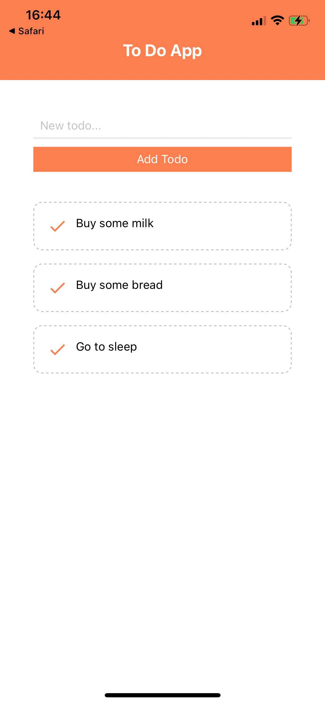

<h1>To Do App</h1>

# To view the app:
## 1. Use your phone. 
<!-- <a href="https://expo.io/client"><h2>2. Download the Expo app</h2> </a> -->
<a href="https://expo.io/--/to-exp/exp%3A%2F%2Fdk-sgb.yordankrushkov.todo-mobile.exp.direct%3A80"><h2>3.View the app</h2></a>

<h4>Description</h4>
A mobile app created on React Native. It has been using Expo.io. 

<h4>Technologies</h4>
React Native

<h4>Server</h4>
Node.JS, Express, Mongo DB, Mongoose.

<a href="https://github.com/YordanKrushkov/todo-server">Back End</a>

<h4>Installation</h4>
1. Fork/clone/download the repo and run npm install inside the folder.  
2. Run npm start.  
  

<h4>Screenshots</h4>

